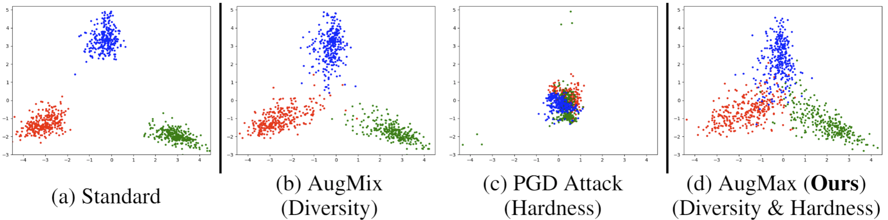
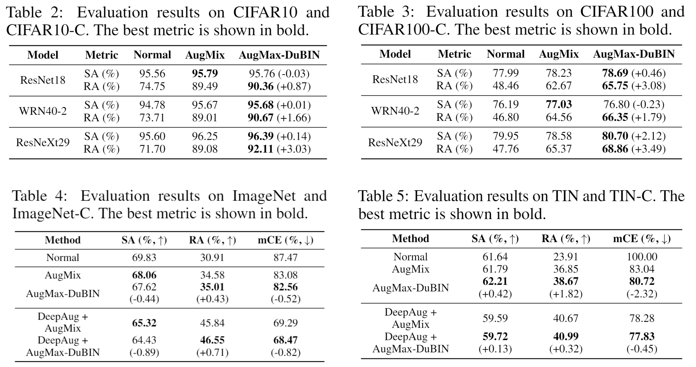

# AugMax: Adversarial Composition of Random Augmentations for Robust Training

[](https://opensource.org/licenses/MIT)

Haotao Wang, Chaowei Xiao, Jean Kossaifi, Zhiding Yu, Anima Anandkumar, and Zhangyang Wang

In _NeurIPS_ 2021

## Overview

We propose AugMax, a data augmentation framework to unify the diversity and hardness. Being a stronger form of data augmentation, AugMax leads to a significantly augmented input distribution which makes model training more challenging. To solve this problem, we further design a disentangled normalization module, termed DuBIN (Dual-Batch-and-Instance Normalization) that disentangles the instance-wise feature heterogeneity arising from AugMax. AugMax-DuBIN leads to significantly improved out-of-distribution robustness, outperforming prior arts by 3.03%, 3.49%, 1.82% and 0.71% on CIFAR10-C, CIFAR100-C, Tiny ImageNet-C and ImageNet-C.

<p align="center">
  </br>
  <span align="center">AugMax achieves a unification between hard and diverse training samples.</span>
</p>

<p align="center">
  </br>
  <span align="center">AugMax achieves state-fo-the-art performance on CIFAR10-C, CIFAR100-C, Tiny ImageNet-C and ImageNet-C.</span>
</p>


## Training

Assume all datasets are stored in `<data_root_path>`. For example, CIFAR-10 is in `<data_root_path>/cifar-10-batches-py/` and ImageNet training set is in `<data_root_path>/imagenet/train`. 

AugMax-DuBIN training on `<dataset>` with `<backbone>` (The outputs will be saved in `<save_root_path>`):

```
python augmax_training_ddp.py --gpu 0 --srp <where_you_save_the_outputs> --drp <data_root_path> --ds <dataset> --md <backbone> --Lambda <lambda_value> --steps <inner_max_step_number>
```

For example:

AugMax-DuBIN on CIFAR10 with ResNeXt29 (By default we use `Lambda=10` on CIFAR10/100 and Tiny ImageNet.):

```
python augmax_training_ddp.py --gpu 0 --drp /ssd1/haotao/datasets --ds cifar10 --md ResNeXt29 --Lambda 10 --steps 10
```

AugMax-DuBIN on CIFAR100 with ResNet18 (We use `Lambda=1` instead of `Lambda=10` in this particular experiment, as noted in the paper.):

```
python augmax_training_ddp.py --gpu 0 --drp /ssd1/haotao/datasets --ds cifar100 --md ResNet18 --Lambda 1 --steps 10
```

AugMax-DuBIN on ImageNet with ResNet18 (By default we use `Lambda=12` on ImageNet. On ImageNet, **weight decay `wd=1e-4`** instead of the default value in the code, which is for CIFAR-level datasets.):

```
NCCL_P2P_DISABLE=1 python augmax_training_ddp.py --gpu 0 --drp /ssd1/haotao/datasets --ds IN --md ResNet18 --Lambda 12 -e 90 --wd 1e-4 --decay multisteps --de 30 60 --ddp --dist_url tcp://localhost:23456
```

AugMax-DuBIN + DeepAug on ImageNet with ResNet18:

```
NCCL_P2P_DISABLE=1 python augmax_training_ddp.py --gpu 0 --drp /ssd1/haotao/datasets --ds IN --md ResNet18 --deepaug --Lambda 12 -e 30 --wd 1e-4 --decay multisteps --de 10 20 --ddp --dist_url tcp://localhost:23456
```

## Pretrained models

The pretrained models are available on [Google Drive](https://drive.google.com/drive/folders/1GH1fjWQuTYruUU7P7BM52Erg2tAfNJuj?usp=sharing).

## Testing

To test the model trained on `<dataset>` with `<backbone>` and saved to `<ckpt_path>`:

```
python test.py --gpu 0 --ds <dataset> --drp <data_root_path> --md <backbone> --mode all --ckpt_path <ckpt_path>
```

For example:

```
python test.py --gpu 0 --ds cifar10 --drp /ssd1/haotao/datasets --md ResNet18_DuBIN --mode all --ckpt_path augmax_training/cifar10/ResNet18_DuBIN/fat-1-untargeted-5-0.1_Lambda10.0_e200-b256_sgd-lr0.1-m0.9-wd0.0005_cos
```

## Citation
```
@inproceedings{wang2021augmax,
  title={AugMax: Adversarial Composition of Random Augmentations for Robust Training},
  author={Wang, Haotao and Xiao, Chaowei and Kossaifi, Jean and Yu, Zhiding and Anandkumar, Anima and Wang, Zhangyang},
  booktitle={NeurIPS},
  year={2021}
}
```
